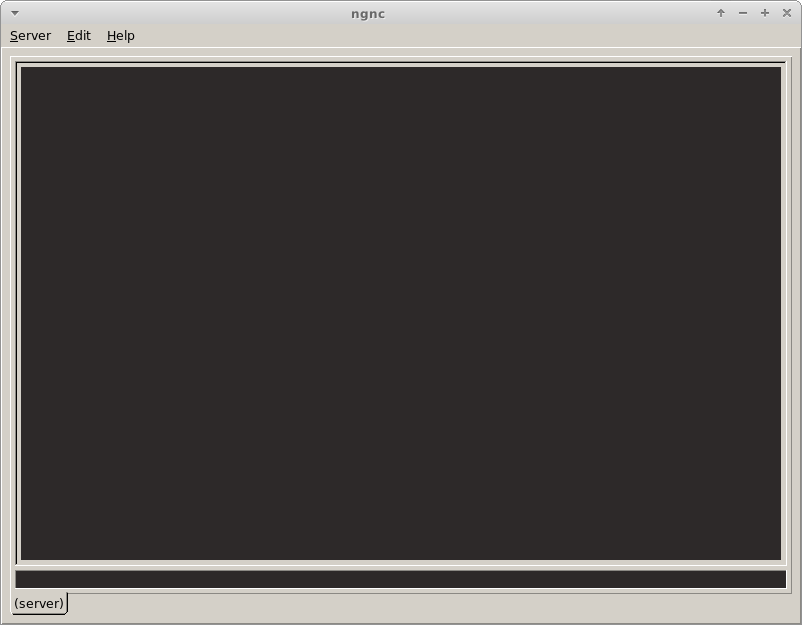

# ngnc
Nextgen Naken Client

# Building
Install the following to build.

```
Ubuntu/Debian: apt-get install libfox-1.6-dev
Arch: pacman -S fox
Fedora: dnf install fox-devel
OpenBSD: pkg_add -iv fox
Void: xbps-install -Syu fox-devel
```

Then create a cmake directory, run cmake, then `make`

```
mkdir build
cd build
cmake ..
make
```


# Screenshot


